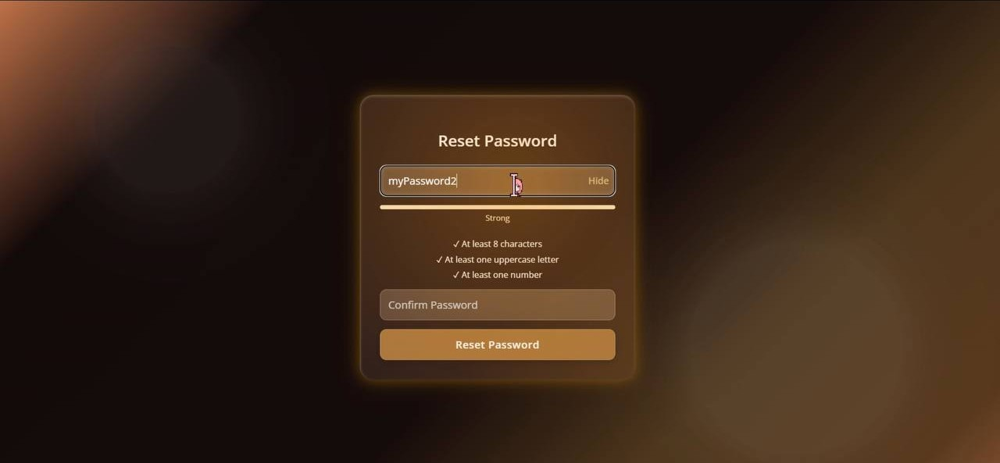
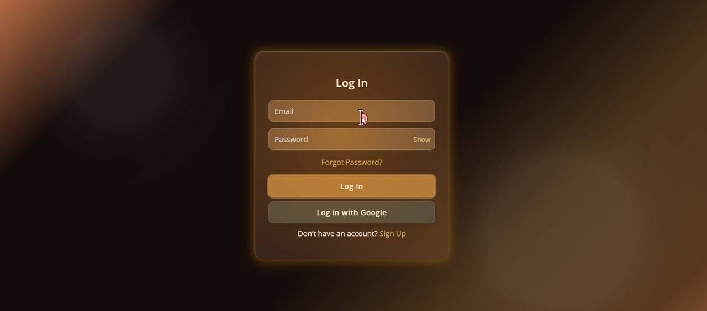
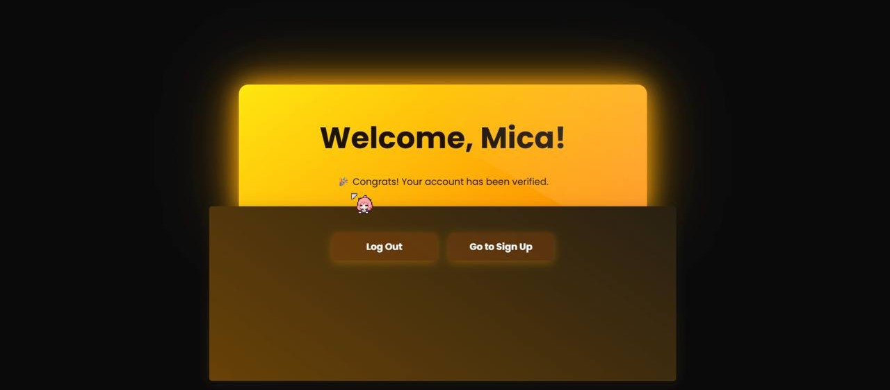

# 📚 Library Auth App – React + Vite + Appwrite + EmailJS

A beautifully designed, **glassmorphic** user authentication system built with **React**, **Vite**, and **Appwrite**. Features **Google OAuth**, secure email login, password recovery, and stunning UI animations.

> 🔗 [🌐 Live Demo](https://react-auth-loginui.netlify.app/)

---

## 📑 Table of Contents

- [🚀 Features](#-features)
- [🧰 Tech Stack](#-tech-stack)
- [🧪 Getting Started](#-getting-started)
- [🎨 UI Design](#-ui-design)
- [🔐 Security](#-security)
- [📧 Email System](#-email-system)
- [📷 Screenshots](#-screenshots)
- [🤝 Contributions](#-contributions)
- [📄 License](#-license)

---

## 🚀 Features

- 🔐 **Secure Appwrite Authentication**
- 🧾 **Email + Google OAuth Login**
- ✅ **Email Verification**
- 📩 **Password Recovery**
- 💌 **Welcome Email (EmailJS)**
- 🧠 **Password Strength Meter + Checklist**
- 🪄 **Animated Glassmorphism UI**
- 📱 **Fully Responsive**
- 🔔 **Custom Toast Notifications**

---

## 🧰 Tech Stack

| Tech               | Purpose                             |
|--------------------|-------------------------------------|
| **React + Vite**   | Fast modern frontend                |
| **Appwrite**       | Auth, DB, email verification        |
| **EmailJS**        | Custom welcome email on signup      |
| **Google OAuth**   | One-click login/signup              |
| **React Toastify** | Beautiful toast notifications       |
| **CSS Effects**    | Glassmorphism, hover, and glow UI   |

---

## 🧪 Getting Started

- git clone https://github.com/danahparis21/react-oauth-login
- cd library-auth-app
- npm install
- npm run dev

## 🎨 UI Design

- Glassmorphism with soft blur & glow effects  
- Fully animated UI (CSS transitions)  
- Minimalist layout with bold icons  
- Mobile-first responsiveness  
- Accessible color contrast  

---

## 🔐 Security

- Email login & reset via **Appwrite** with token validation  
- OAuth with Google using secure redirect & client secrets  
- Password hashing & recovery logic handled backend-side  
- Email verification required before user access  

---

## 📧 Email System

### Verification & Password Reset
- Managed by Appwrite  
- Secured using unique `userId` and secret token  

### Welcome Email
- Sent automatically via **EmailJS** after successful signup  
- Includes brand-colored button and contact information  

---

## 📸 Screenshots

Click to view screenshots 📷

 

  
  

  
  

---

## 🤝 Contributions

Pull requests and ideas are welcome!  
For major changes, please open an issue to discuss them first.

---

## 📄 License

**MIT License** – Free to use, remix, or build upon, with attribution.

---

## 🙌 Developer

Built with 💖 by **Danah Paris**  
📧 Email: [micadanah21@gmail.com](mailto:micadanah21@gmail.com)  
📍 BatStateU – BSIT Student
